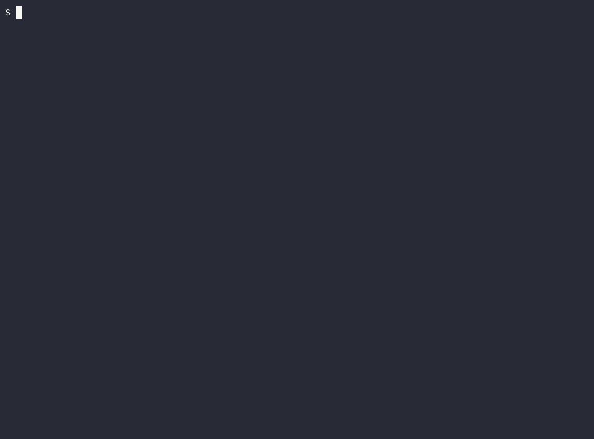

<p align="center">
  
</p>

<h1 align="center">Your website is invisible to 1 in 5 people.</h1>

<p align="center"><sub>Check in 20 seconds. Fix in your source, not in a report you file and forget.</sub></p>

---

## The 20-second check

Point your agent at any page. It finds what a screen reader can't announce,
then **edits your source** to fix it:

```bash
node scan.mjs https://your-site.com
```

```
6 violations — 2 critical, 1 serious, 3 moderate
[CRITICAL] button-name — Buttons must have discernible text
  target: button
  html:   <button></button>
  why:    Element does not have inner text that is visible to screen readers

[SERIOUS] color-contrast — insufficient contrast of 2.16
  target: p
  html:   <p class="muted">Helper text that is too light to read.</p>
  why:    expected ratio 4.5:1
```

No account, no API key, no upload, no server. It runs on `localhost`, on
private IPs, and offline — because your unreleased page is exactly the one you
need to check.

## What makes this different from axe-core

axe-core is the engine and it's excellent. The gap is everything *after* it.

axe-core says `color-contrast failed`. This says:

> `--text-muted` is 2.62:1. WCAG AA needs 4.5:1. Raise it to `--text-secondary`
> (4.7:1) or darken the background — don't drop the font below 14px to cheat.

**34 rules, each with the concrete edit, not the rule name.** Landmarks,
labels, contrast, focus order, ARIA misuse, table headers, video captions.

| | axe-core CLI | this |
|---|---|---|
| Finds violations | yes | yes, same engine |
| Tells the agent *what to change* | no | yes, per rule |
| Runs on localhost / private IPs | needs setup | yes, zero setup |
| Server, quota, or network | needs a driver | none |
| Your source code leaves the machine | n/a | never |

## Install

```bash
git clone https://github.com/wrinfotel/a11y-lint.git
cd a11y-lint/skills/a11y-audit && npm install axe-core
```

Then point your agent at `skills/a11y-audit/`.

<details>
<summary>Or install straight into an agent</summary>

```bash
cp -r a11y-lint/skills/a11y-audit .claude/skills/
cd .claude/skills/a11y-audit && npm install axe-core
```
</details>

## The loop

The demo above is the whole product on a local fixture: **4 violations → agent
edits the source → 0 violations**, with `rules passed` climbing 13 → 19 as the
markup got more semantic.

## Honest limits

A scan is not an audit. axe-core catches roughly a third of WCAG — keyboard
traps, focus order, and whether alt text is *good* still need a human. One page,
no crawling. And if the scanner exits non-zero, the audit did **not** happen;
read the skill for how to report that honestly instead of claiming a clean run.

## License

MIT
